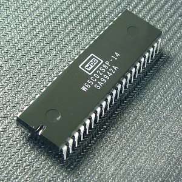

=== The Big Picture

This section provides background information on Scheme, the 6502 processor, and
why anybody would want to combine the two. It can be skipped if you already know
all those things.

==== The 6502 MPU

[quote, H.P. Lovecraft, The Nameless City]
That is not dead which can eternal lie, +
And with strange aeons even death may die. <<LSK>>

(This passage is adapted from the _Tali Forth 2 Manual_ by Sam Colwell and Scot W.
Stevenson)

It is a well-established fact that humanity reached the apex of processor design
with the 6502(((6502))) in 1976. 

[#img_65c02]
.by Anthony King, public domain

Created by a team including Chuck Peddle((("Peddle, Chuck"))) and Bill
Mensch((("Mensch, Bill"))), it was the engine that powered the 8-bit home
computer revolution of the 1980s.footnote:[Rumor has it that there was another
MPU called "Z80",(((Z80))) but it ended up being a mere footnote.] The
VIC-20(((VIC-20))), Commodore PET(((Commodore PET))), Apple II(((Apple II))),
and Atari 800(((Atari 800))) all used the 6502, among others.

More than 40 years later, the processor is still in production by the
http://www.westerndesigncenter.com/wdc/w65c02s-chip.cfm[Western Design
Center](((WDC))). Apart from commercial uses, there is an active hobbyist scene
centered on the website http://6502.org/[6502.org].(((6502.org))) A
number of people have built their own 8-bit computers based on this chip and
the instructions there, including a
http://wilsonminesco.com/6502primer/[primer] by Garth Wilson((("Wilson,
Garth"))). It is for these systems that Tali Forth 2 was created.

The most important variant of the 6502 produced today is the 
https://en.wikipedia.org/wiki/WDC\_65C02[65c02](((65c02))), a CMOS chip with
some additional instructions. It is for this chip that Tali Forth 2 was written.

But why program in 8-bit assembler at all? The 65c02 is fun to work with
because of its clean instruction set architecture (ISA)(((instruction set
architecture (ISA) ))) This is not the place to explain the joys of assembler.
The official handbook for the 65c02 is _Programming the 65816_ <<EnL>>.

TIP: Garth  Wilson((("Wilson, Garth"))) answers this question in greater
detail as part of his 6502 primer at http://wilsonminesco.com/6502primer/ .

==== Lisp and Scheme 

[quote, Sinclair Target, How Lisp Became God's Own Programming Language]
Lisp was concocted in the ivory tower as a tool for artificial intelligence
research, so it was always going to be unfamiliar and maybe even a bit
mysterious to the programming laity. But programmers now urge each other to "try
Lisp before you die" as if it were some kind of mind-expanding psychedelic. <<ST>>

For the early history of Lisp, see
link:http://jmc.stanford.edu/articles/lisp/lisp.pdf[A History of Lisp] by John
McCarthy. 

==== Getting started with Scheme 

If you are completely new to Scheme, you might want to work through a tutorial
first, for example link:http://ds26gte.github.io/tyscheme/index-Z-H-1.html[Teach
Yourself Scheme in Fixnum Days] by Dorai Sitaram(((Sitaram, Dortai))) <<DS>> or
_The Little Schemer_ by Daniel P. Friedman <<DPF>>. 

=== Writing your own Scheme or Lisp

Even if the 65c02 is great and Scheme is brilliant, why go to the effort of
writing a new, bare-metal version of the languages? After almost 50 years,
shouldn't there be a bunch of versions around already?

Well, no. For some reason, there doesn't seem to be a version of Scheme for the
65c02 available, though there are lots of Forths and BASICs. To be honest, this
has become increasingly worrying, but at this point, we will march on. 

TODO

As a more general problem, no sane person seems to be interested in creating
their own Lisp in assembler. Pretty much all the guides are in C. 

(TODO Note _Lisp in Small Pieces_)

=== Is this a Lisp or a Scheme?

Purists might be worried if this is a Lisp or a Scheme. Some people an get
_really_ excited about this. However, Cthulhu Scheme is so primitive that the
distinction doesn't really make much sense. Because Cthulhu Scheme follows
_Structure and Interpretation of Computer Programs_ <<HA>>, it looks a bit more
like Scheme than Common Lisp. 

=== A Note on the Name

Cthulhu, a creation by H.P. Lovecraft,((("Lovecraft, H.P."))) is one of the
Great Ancient Ones, and so is Lisp, a great ancient programming language of
awesome and terrible power. However, you could also say that given my rather
rudimentery Scheme and Lisp skills, this Scheme version is something of a
monster that should have stayed hidden in the formless void.  
